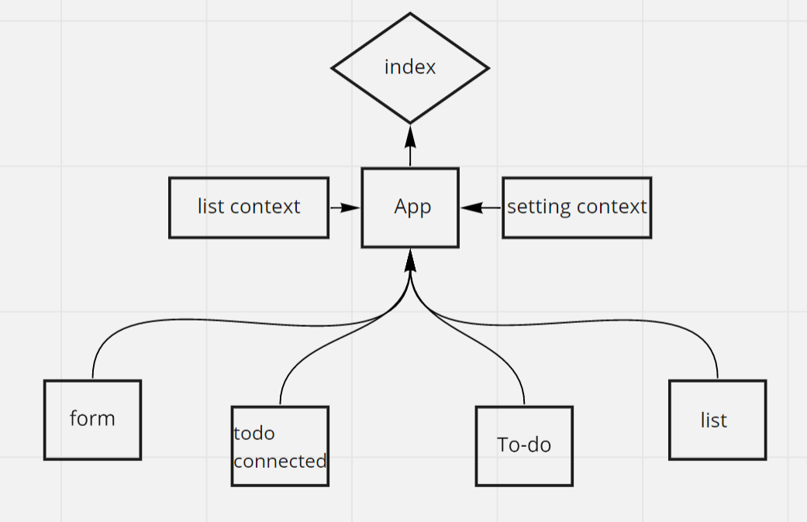

# LAB 31 - Context API

**To Do List Manager Phase 1: Incorporate configuration settings to the application**

In this phase, we’ll be adding some top-level settings for the application, so that the user can make some display choices that the app will use by default.

## Phase 1 Requirements

In Phase 1, we’re going to perform some refactoring of the To Do application as built by another team. This application mixes application state and user settings at the top level and passes things around. It was a good proof of concept, but we need to make this production ready.

Style the application using the Blueprint Component API{target:_blank}

Properly modularize the application into separate components

Implement the Context API to make some basic application settings available to components

1- How many To Do Items to show at once 2- Whether or not to show completed items

**Based on global configuration**

- Show a maximum of a certain number of items per screen in the component
- Provide “next” and “previous” links to let the users navigate a long list of items
- Hide or show completed items in the list

**Implement this using context**

- Create a context for managing application display settings and provide this at the application level
- Display or Hide completed items (boolean)
- Number of items to display per screen (number)
- Default sort field (string)
- Manually set (hard code) those state settings in the context provider’s state, they should not be changeable

